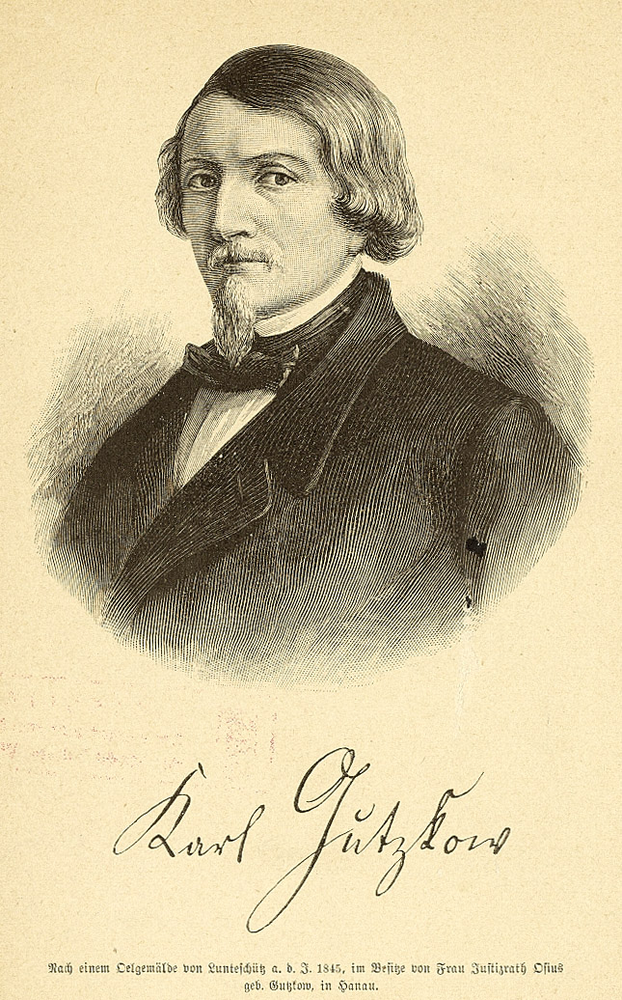

Gutzkow 1845, Holzstich nach einem Ölbild von Jules Lunteschütz
===============================================================

Gutzkow 1845, Holzstich nach einem Ölbild von Jules Lunteschütz

.. rst-class:: source

  (Johannes Proelß: Das junge Deutschland. Stuttgart: Cotta, 1892.)
