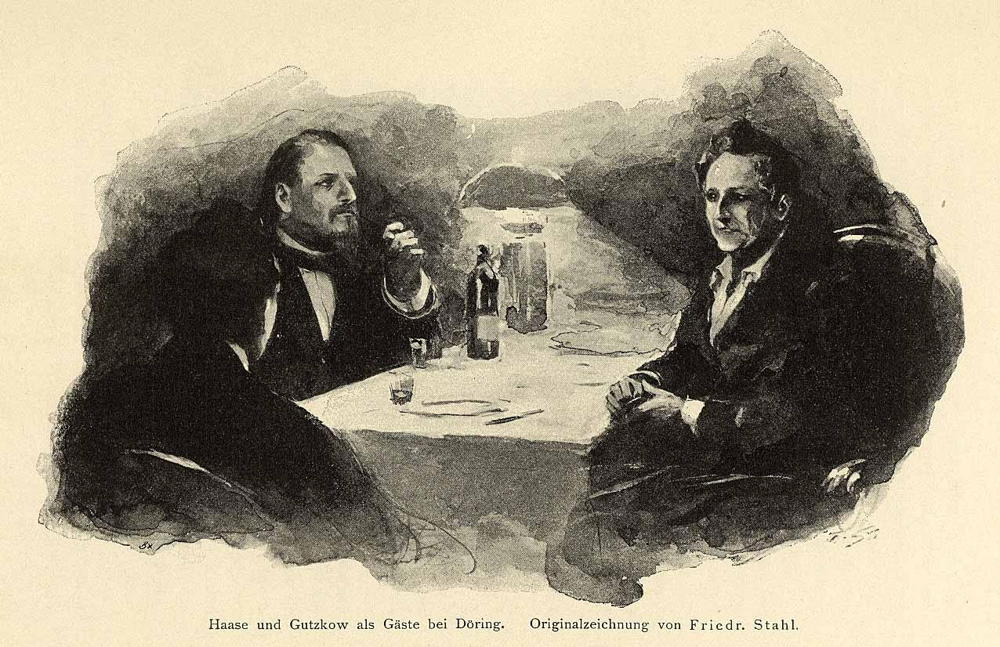

Haase, Gutzkow und Döring, Zeichnung von Friedrich Stahl 1897
=============================================================

Haase, Gutzkow und Döring, Zeichnung von Friedrich Stahl 1897

.. rst-class:: source

  (Friedrich Haase: Was ich erlebte. 1846-1896. 2. Aufl. Berlin, Leipzig, Wien, Stuttgart: Bong, [um 1897], S. 79.)
