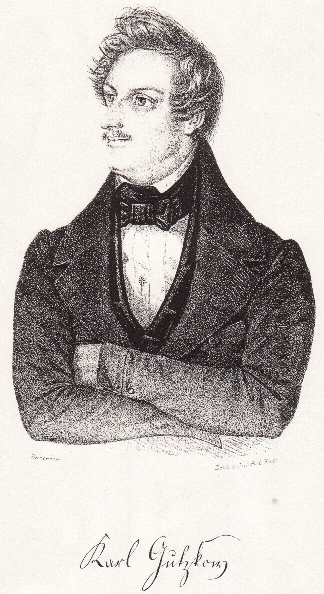

:::{rst-class} image-gallery-item
:::
# Gutzkow 1841, Lithographie von Heinemann

::::{card}

+++
Gutzkow 1841, Lithographie von Heinemann
::::

## Quelle

(Europa. Chronik der gebildeten Welt. Karlsruhe. 1841, Bd. 2)
