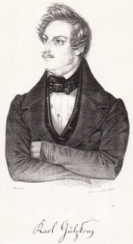

Gutzkow 1841, Lithographie von Heinemann
========================================

Gutzkow 1841, Lithographie von Heinemann

.. rst-class:: source

  (Europa. Chronik der gebildeten Welt. Karlsruhe. 1841, Bd. 2)
