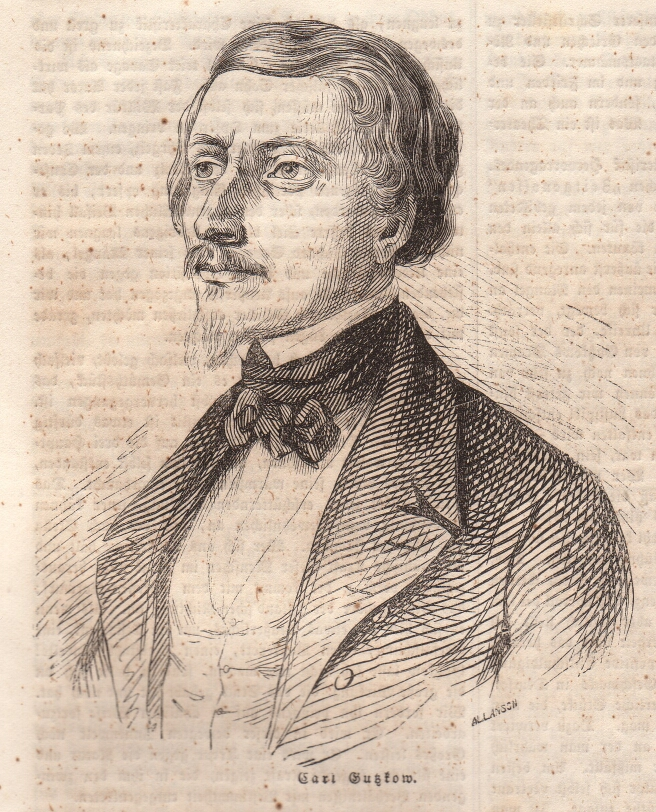

:::{rst-class} image-gallery-item
:::
# Gutzkow 1844, Holzstich von John Allanson

::::{card}

+++
Gutzkow 1844, Holzstich von John Allanson
::::

## Quelle

(Illustrirte Zeitung. Leipzig. Bd. 2, 17. Feb. 1844, S. 124)
