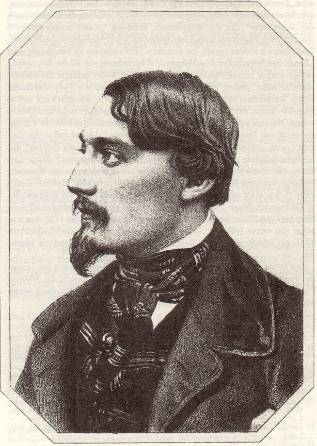

:::{rst-class} image-gallery-item
:::
# Gutzkow um 1844, Lithographie von Valentin Schertle

::::{card}

+++
Es ist nicht ganz sicher, wann Valentin Schertle (1809-1885) das Bild anfertigte und wo die Lithographie zuerst veröffentlicht wurde. Möglicherweise schon 1840.
::::

## Quelle

(Jan-Christoph Hauschild: Georg Büchner. Studien u. neue Quellen zu Leben, Werk u. Wirkung. Mit zwei unbekannten Büchner-Briefen. Königstein (Ts.): Athenäum 1985. S. 41)
