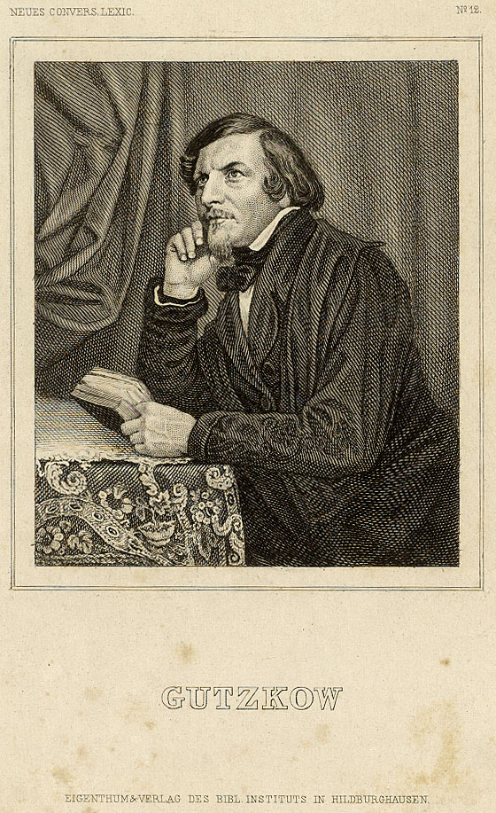

Gutzkow um 1847, Stahlstich des Bibliographischen Instituts Hildburghausen
==========================================================================

Gutzkow um 1847, Stahlstich des Bibliographischen Instituts Hildburghausen

.. rst-class:: source

  (Meyers Conversationslexikon für die gebildeten Stände. Hildburghausen: Bibliographisches Institut 1847-1852.)
