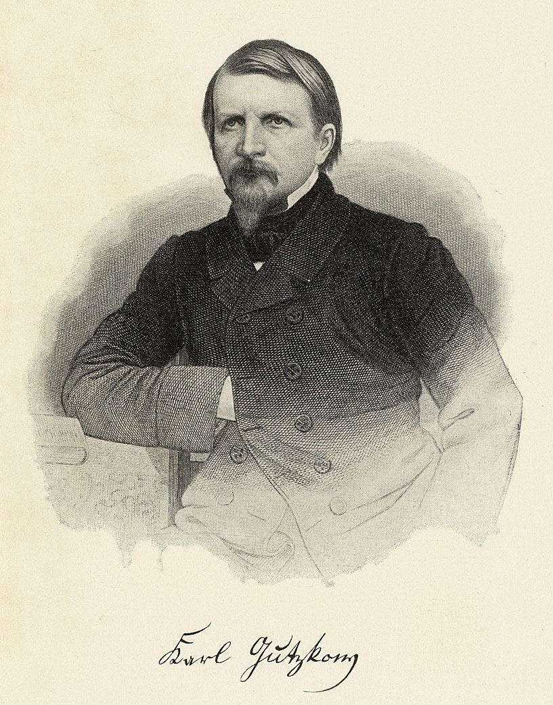

Gutzkow um 1856, gez. und gest. von August Weger
================================================

Gutzkow um 1856, gez. und gest. von August Weger

.. rst-class:: source

  (Emil Devrient. Sein Leben, sein Wirken, sein Nachlass. Ein Gedenkbuch von Heinrich Hubert Houben. Frankfurt/M.: Literarische Anstalt, 1903.)
