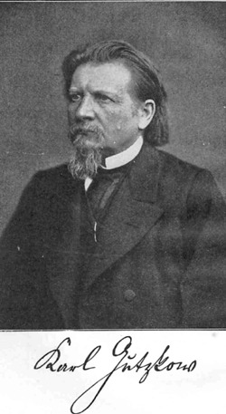

Gutzkow um 1875, Photo der Photograf. Gesellschaft Berlin
=========================================================

Gutzkow um 1875, Photo der Photograf. Gesellschaft Berlin

.. rst-class:: source

  (Karl Gutzkows Meisterdramen. Drei Teile in einem Bande. Hg. von Heinrich Hubert Houben. Leipzig: Max Hesses Verlag, o.J., Vorsatzblatt vor der Titelseite.)
