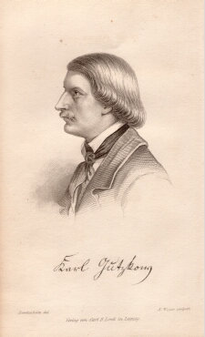

Gutzkow 1846, gez. von Jules Lunteschütz, gest. von Weger
=========================================================

Das 1848 veröffentlichte Bild von Jules Lunteschütz (1822-1893) wurde im September 1846 gezeichnet und von Gutzkow als "recht gelungenes"

.. rst-class:: source

  (Aus: Karl Gutzkows dramatische Werke. Bd. 6. Leipzig: Lorck 1848)
