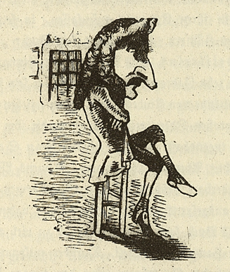

:::{rst-class} image-gallery-item
:::
# Gutzkow als "Karl Trutzkopf", anon. Karikatur 1848

::::{card}

+++
Gutzkow sitzt im Mannheimer Gefängnis 1836.
::::

## Quelle

(X.Y.Z. Satyrisch-literarisches Taschenbuch für 1848. Unter Mitwirkung des jüngsten Deutschlands hg. von einem Unberühmten [d.i. Otto Bernhard Friedmann]. Leipzig: Spamer, [1848]. S. 8)
