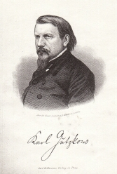

Gutzkow 1857, Stahlstich von Alexander Alboth Leipzig
=====================================================

Gutzkow 1857, Stahlstich von Alexander Alboth Leipzig

.. rst-class:: source

  (Jahrbuch Deutscher Belletristik auf 1858. 4. Jg. Hrsg. von Siegfried Kapper. Mit d. Bildn. Karl Gutzkow's in Stahlstich. Prag: Bellmann [1857])
