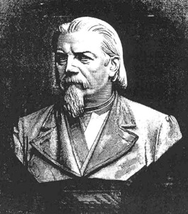

Büste des Gutzkow-Denkmals in Dresden von E. M. Andresen
========================================================

Das Gutzkow-Denkmal - eine überlebensgroße Büste - wurde am 11. Juli 1887 vor der Kreuzschule in Dresden auf dem Georgsplatz zur Seite des Körnerdenkmals enthüllt..

.. rst-class:: source

  (Aus: Illustrirte Zeitung. Leipzig. 30. Juli 1887.)
