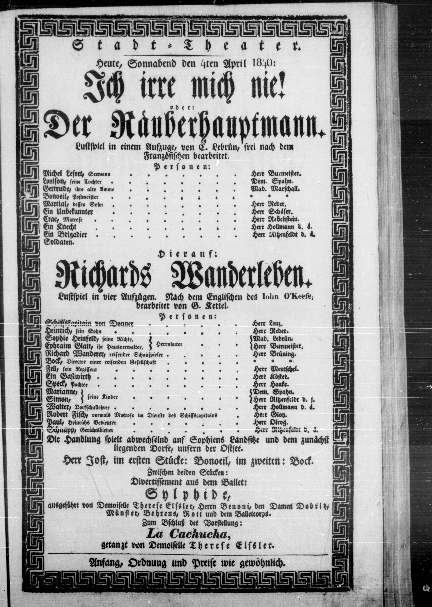

Theaterzettel zur Aufführung von „Ich irre mich nie! oder: Der Räuberhauptmann“ und „Richards Wanderleben“
==========================================================================================================

Theaterzettel zur Aufführung von „Ich irre mich nie! oder: Der Räuberhauptmann“ nach dem Französischen bearbeitet von C. Lebrün, und „Richards Wanderleben“ nach dem Englischen des John O’Keeffe bearbeitet von G. Kettel, am Hamburger Stadttheater, 4. April 1840. Quelle: https://www.stadttheater.uni-hamburg.de (DFG-Projekt „Bühne und Bürgertum. Das Hamburger Stadttheater 1770-1850“).

.. rst-class:: source

    Wir danken Herrn Prof. Dr. Bernhard Jahn, Universität Hamburg, für die Erlaubnis der Reproduktion.
