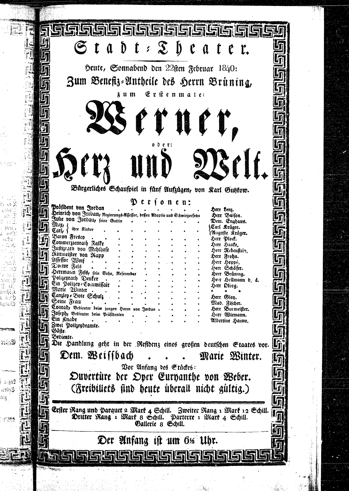

Theaterzettel zur Erstaufführung von Gutzkows Werner, oder: Herz und Welt
=========================================================================

Theaterzettel zur Erstaufführung von Gutzkows Werner, oder: Herz und Welt am Hamburger Stadttheater, 22. Februar 1840. Quelle: https://www.stadttheater.uni-hamburg.de (DFG-Projekt „Bühne und Bürgertum. Das Hamburger Stadttheater 1770-1850“).

.. rst-class:: source

    Wir danken Herrn Prof. Dr. Bernhard Jahn, Universität Hamburg, für die Erlaubnis der Reproduktion.
