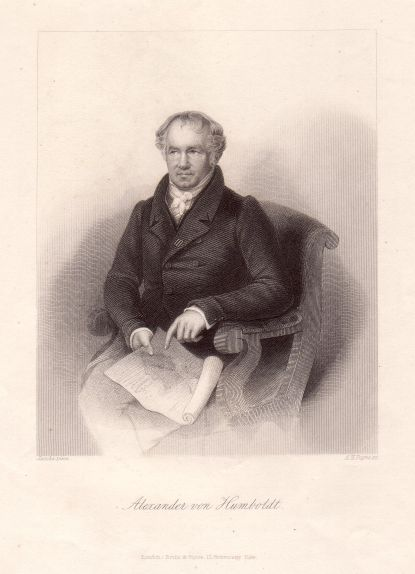

Alexander von Humboldt
======================

Alexander von Humboldt, 1769-1859.

.. rst-class:: source

  (Stahlstich um 1850 von Albert Henry Payne nach einem Bild von Emil Jacobs, Verlag Brain & Payne, London. Einzelblatt, Privatbesitz)
