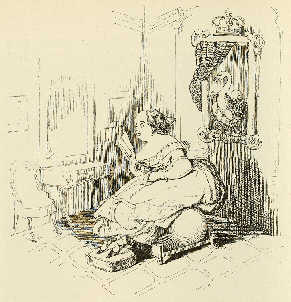

Charlotte Birch-Pfeiffer als Leda
=================================

Charlotte Birch-Pfeiffer als Leda, brütet unermüdlich Eier aus. Karikatur von Alexander von Ungern-Sternberg (1848)

.. rst-class:: source

  (Tutu. Phantastische Episoden und poetische Exkursionen von A. von [Ungern-] Sternberg. Mit Illustr. von Sylvan [d.i. A. von Ungern-Sternberg]. Meersburg: Hendel, 1936. [Reprint der Ausg. Leipzig 1848] S. 138.)

Vgl. auch den entsprechenden Artikel
