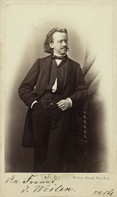

Albert Emil Brachvogel
======================

Albert Emil Brachvogel, 1824-1878

.. rst-class:: source

  (Photographie um 1865, Privatbesitz.)

Verfasser zahlreicher historischer Dramen, Romane und Novellen.
