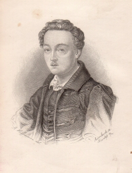

Georg Büchner
=============

Georg Büchner

.. rst-class:: source

  (Stahlstich von A. Limbach nach einem Bild von Adolf Hoffmann. In: Georg Büchner: Sämmtliche Werke und handschriftlicher Nachlaß. Erste krit. Gesammt-Ausg. Eingeleitet u. hg. von Karl Emil Franzos. Mit Portr. d. Dichters u. Ansicht des Züricher Gedenksteins. Bd. 1. Frankfurt/M.: Sauerländer, 1879.)
