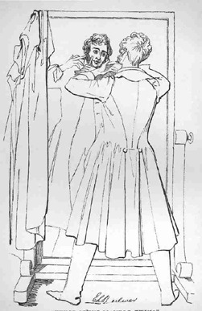

Edward Lytton Bulwer
====================

Edward Lytton Bulwer. Radierung nach einer Zeichnung von Daniel Maclise. Erstveröffentlichung in: Fraser's Magazine. London. Bd. 6, Nr. 31, August 1832, vor S. 112.

Vgl. auch den BegleittextBulwer-Artikel
