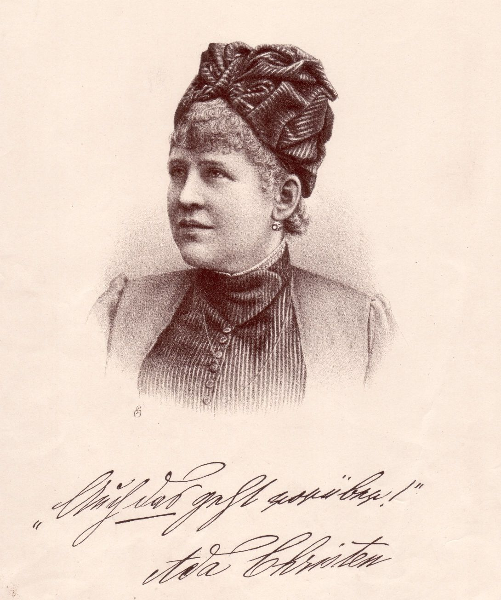

Ada Christen
============

Ada Christen, 1839-1901.

das

.. rst-class:: source

  (Lithographischer Druck. Einzelnes Blatt, gedruckt bei Jos. Eberle in Wien, etwa 1880.)

Das gedruckte Autograph Ada Christens - ihr Lebensmotto - lautet: "Auch das
