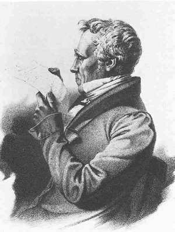

Johann Friedrich Cotta
======================

Johann Friedrich Cotta, 1764-1832

.. rst-class:: source

  (Lithographie von Unbekannt, SNM/Cotta-Archiv, Abb. in: Deutsche Schriftsteller im Portrait, Bd 3: Sturm und Drang, Klassik, Romantik. Hg. von Jörn Göres. München 1980, S. 46.)

Das Portrait soll das dem Verleger ähnlichste sein.

Vgl. auch den entsprechenden Artikel
