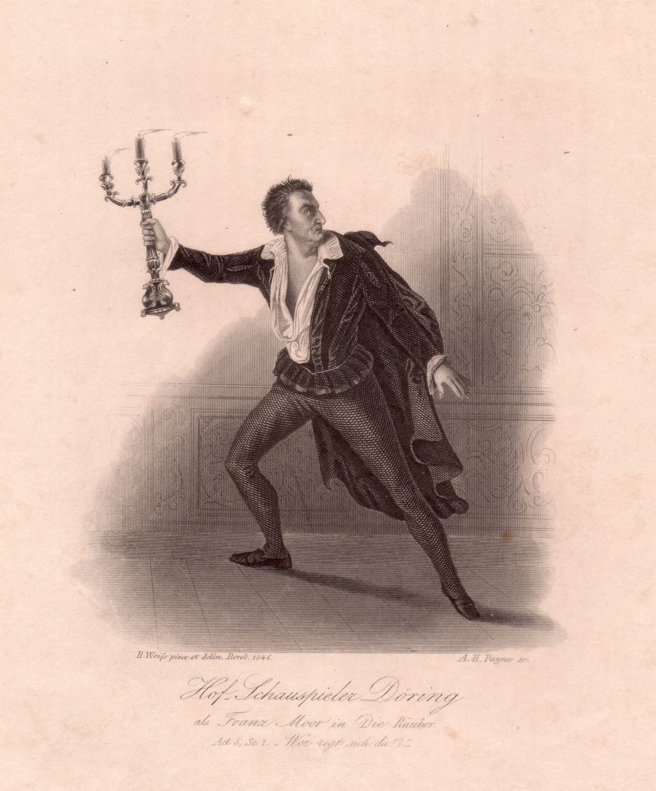

Theodor Döring
==============

Theodor Döring, 1803-1878.

.. rst-class:: source

  (Stahlstich von 1846, gezeichnet von Hermann Weiß, gestochen von Albert Henry Payne. Einzelblatt, Privatbesitz)

Theodor Döring als Franz Moor in Schillers „Die Räuber“.
