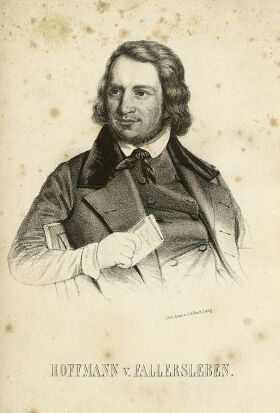

Hoffmann von Fallersleben
=========================

Hoffmann von Fallersleben, 1798-1874

.. rst-class:: source

  (Die politischen Lyriker unserer Zeit. Ein Denkmal mit Portraits und kurzen historischen Charakteristiken. Leipzig: Verlagsbureau 1847.)

Vgl. auch den entsprechenden Artikel
