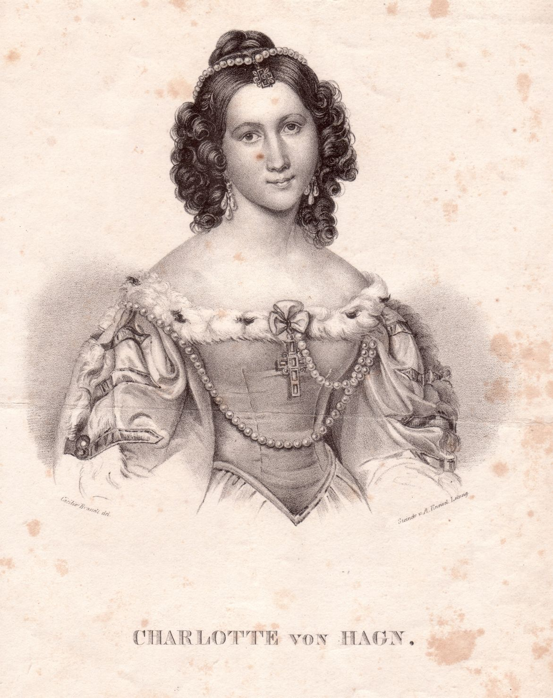

Charlotte von Hagn
==================

Charlotte von Hagn, 1809-1891.

.. rst-class:: source

  (Lithographie um 1842, gezeichnet von Cäcilie Brand, Steindruck von August Kneisel in Leipzig. Einzelblatt, Privatbesitz)
