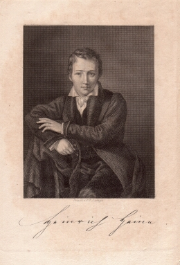

Heinrich Heine 1839
===================

Heinrich Heine

.. rst-class:: source

  (Stahlstich nach einem Gemälde von Moritz Oppenheim. In: Jahrbuch der Literatur. Erster Jahrgang. Mit H. Heine's Bildniß. Hamburg: Hoffmann u. Campe, 1839.)
