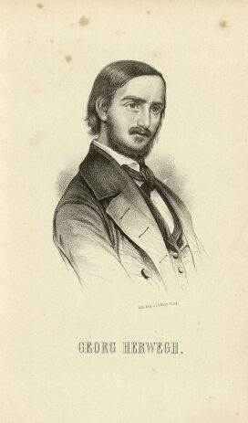

Georg Herwegh
=============

Georg Herwegh, 1817-1875

.. rst-class:: source

  (Die politischen Lyriker unserer Zeit. Ein Denkmal mit Portraits und kurzen historischen Charakteristiken. Leipzig: Verlagsbureau 1847.)
