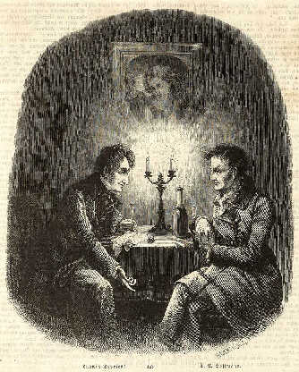

E.T.A. Hoffmann und Ludwig Devrient
===================================

Ernst Theodor Amadeus Hoffmann (1776-1822) und Ludwig Devrient (1784-1832) in der Weinstube Lutter und Wegener,

.. rst-class:: source

  (Die Gartenlaube. Leipzig. 1856, S. 665.)
