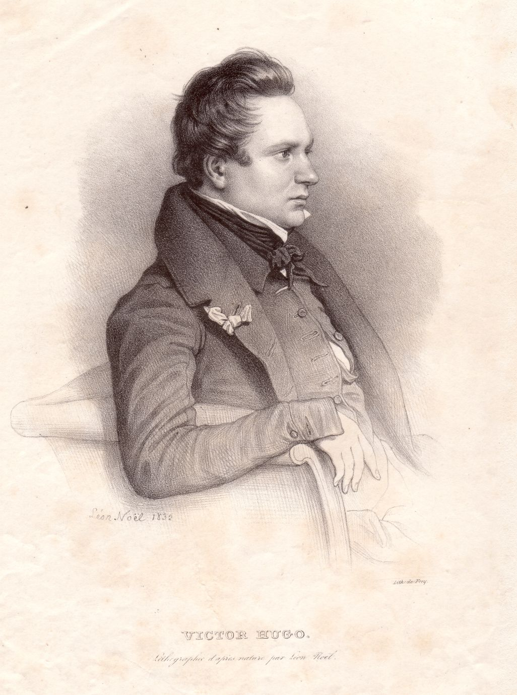

Victor-Marie Hugo
=================

Victor-Marie Hugo, 1802-1885.

.. rst-class:: source

  (Lithographie von Frey, um 1840, nach einem Bild von Léon Noël aus dem Jahr 1832. Einzelblatt, Privatbesitz)
