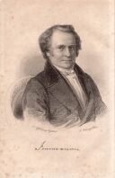

Karl Immermann, 1838
====================

Karl Immermann, 1796-1840

.. rst-class:: source

  (Stahlstich nach einem Bild von Carl Friedrich Lessing, gestochen von Franz Stöber. In: Taschenbuch dramatischer Originalien. Hrsg. von Franck. 2. Jg. Leipzig: Brockhaus, 1838.)
