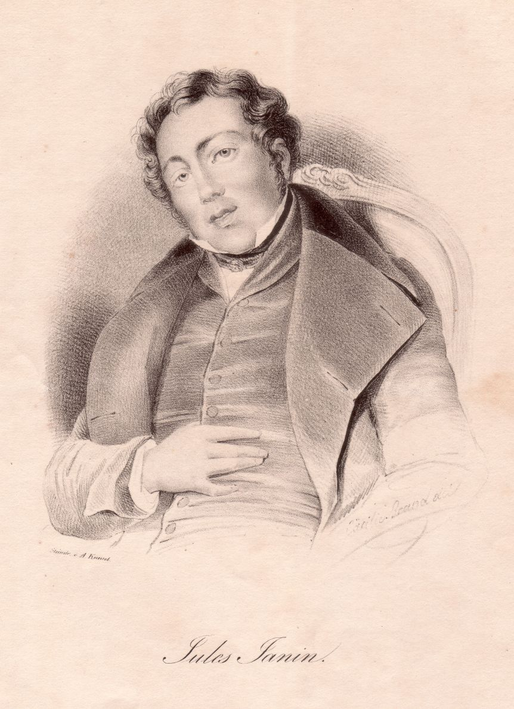

Jules-Gabriel Janin
===================

Jules-Gabriel Janin, 1804-1874.

.. rst-class:: source

  (Lithographie von August Kneisel nach einer Zeichnung von Cäcilie Brand, um 1840. Einzelblatt, Privatbesitz)
