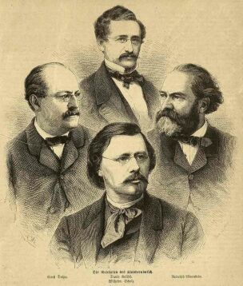

Die Gelehrten des Kladderadatsch
================================

Die Gelehrten des Kladderadatsch: Ernst Dohm, 1819-1883; David Kalisch, 1820-1872; Rudolph Löwenstein, 1819-1891; Wilhelm Scholz, 1824-1893

.. rst-class:: source

  (Die Gartenlaube. Leipzig 1867, S. 205.)
