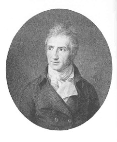

August von Kotzebue
===================

August von Kotzebue, 1761-1819

.. rst-class:: source

  (Stich von J.B. Bittheuser nach Fr. Tischbein, 1809, Goethe-Museum Düsseldorf, Abb. in: Deutsche Schriftsteller im Portrait, Bd 3: Sturm und Drang , Klassik, Romantik. Hg. von Jörn Göres. München 1980, S. 138.)

Vgl. auch den entsprechenden Artikel
