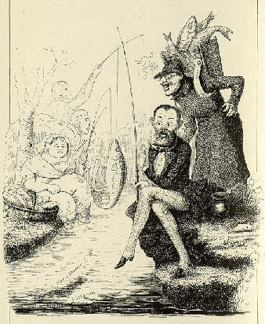

Laube, Raupach, Birch
=====================

Charlotte Birch-Pfeiffer (als Fischersfrau), Heinrich Laube (als verschreckter Angler) und Ernst Raupach mit einer Kiepe, in der sich dicke Fische befinden (einer trägt die Aufschrift "Hohenstaufen", Anspielung auf Raupachs zahlreiche Hohenstaufendramen). Das Erschrecken Laubes erklärt sich durch den Schriftzug "Friedrich II." auf seinem Fisch, Hinweis auf die Zensurvorschrift, keinen Hohenzollern auf die Bühne bringen zu dürfen. Karikatur von Alexander von Ungern-Sternberg

.. rst-class:: source

  (Tutu. Phantastische Episoden und poetische Exkursionen von A. von [Ungern-]Sternberg. Mit Illustr. von Sylvan [d.i. A. von Ungern-Sternberg]. Meersburg: Hendel 1936. [Reprint d. Ausg. Leipzig 1848], S. 178.)

Vgl. auch den entsprechenden Artikel zu LaubeRaupachBirch-Pfeiffer
