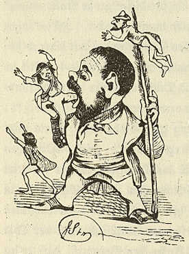

Heinrich Laube
==============

Heinrich Laube, 1798-1873, als "Heinrich Lobe". Dargestellt wird, wie er in Karlsbad einige Slawen verzehrt

.. rst-class:: source

  (X. Y. Z. Satirisch-literarisches Taschenbuch für 1848. Unter Mitwirkung des jüngsten Deutschlands hg. von einem Unberühmten [d.i. Otto Bernhard Friedmann]. Leipzig: Spamer, 1848. S. 24 .)

Vgl. auch den entsprechenden Artikel
