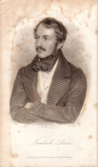

Nicolaus Lenau
==============

Nicolaus Lenau, 1802-1850

.. rst-class:: source

  (Stahlstich nach einem Bild von Staub, gestochen von C. Mahlknecht, in: Nicolaus Lenau: Gedichte. 3. Aufl. Stuttgart und Tübingen: Cotta, 1837.)
