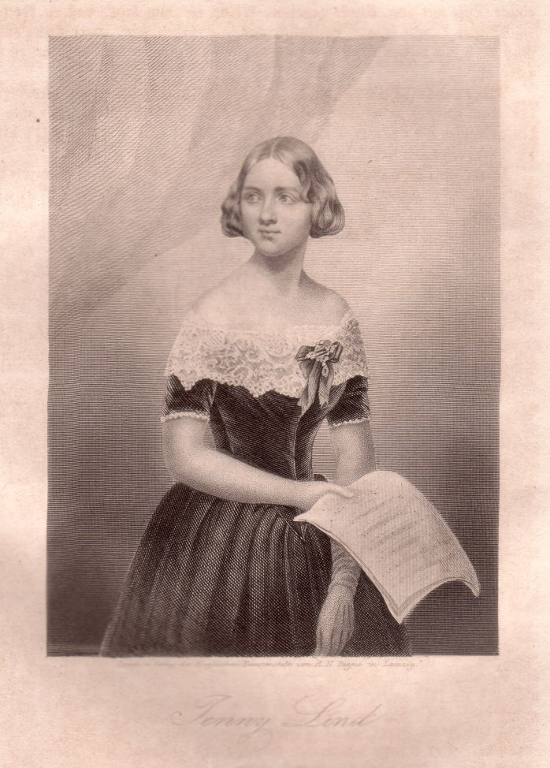

Jenny Lind
==========

Jenny Lind (seit 1852 verh. Goldschmidt), 1820-1887.

.. rst-class:: source

  (Stahlstich in: Blumen der Zeit. Magazin der neuesten Erzählungen, Gedichte, Novellen, Phantasiestücke und Humoresken [usw.]. Bd. 1. Leipzig: Payne, 1847.)
