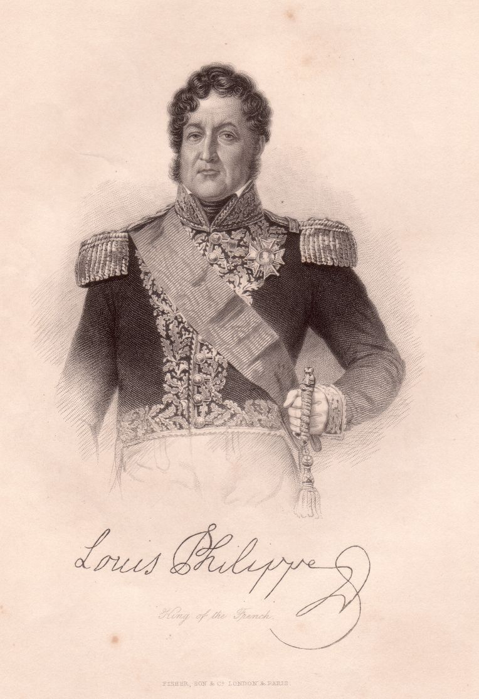

Louis Philippe
==============

Louis Philippe, duc d’Orléans, 1773-1850.

.. rst-class:: source

  (Stahlstich des Verlags Fisher, Son & Co., London & Paris, um 1840. Einzelblatt, Privatbesitz)

Von 1830 bis 1848 König der Franzosen, genannt der ›Bürgerkönig‹.
