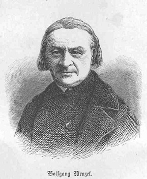

Wolfgang Menzel, Titelkupfer 1877
=================================

Wolfgang Menzel, 1798-1873

.. rst-class:: source

  (Titelkupfer, in: Wolfgang Menzel's Denkwürdigkeiten. Hg. von Konrad Menzel. Drei Bücher in einem Bande. Mit einem Portrait des Verfassers. Bielefeld und Leipzig: Velhagen & Klasing, 1877.)

Vgl. auch den entsprechenden Artikel
