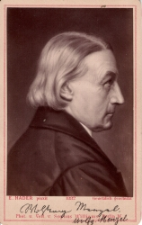

Wolfgang Menzel, Photographie
=============================

Wolfgang Menzel, 1798-1873

.. rst-class:: source

  (Photographie aus späteren Jahren von E. Hader. Albuminabzug von Sophus Williams, Berlin.)

Vgl. auch den entsprechenden Artikel
