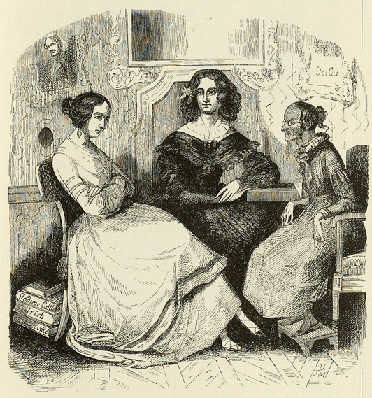

Paalzow, Hahn-Hahn und Bettina von Arnim
========================================

Ida Gräfin Hahn-Hahn, Henriette Paalzow und Bettina von Arnim, das "Kind", das hier ironischerweise greisenhaft dargestellt ist.

Man erkennt ein paar Buchtitel der drei Damen, "Goethes Briefwechsel mit einem Kinde" (B. v. Arnim), "Ulrich" (Hahn-Hahn) und "Godwie-Castle" (Paalzow). Karikatur von Alexander von Ungern-Sternberg (1848)

.. rst-class:: source

  (Tutu. Phantastische Episoden und poetische Exkursionen von A. von [Ungern-] Sternberg. Mit Illustr. von Sylvan [d.i. A. von Ungern-Sternberg]. Meersburg: Hendel 1936. [Reprint d. Ausg. Leipzig 1848], S. 83.)
