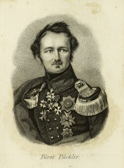

Fürst von Pückler-Muskau
========================

Hermann Ludwig Heinrich Fürst von Pückler-Muskau, 1785-1871

.. rst-class:: source

  (Stahlstich, in: Deutsches Taschenbuch auf das Jahr 1837. Hg. von Karl Büchner. Berlin: Duncker u. Humblot 1837.)

Vgl. auch den entsprechenden Artikel
