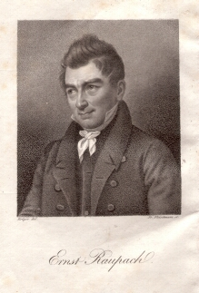

Ernst Raupach, Werke 1829
=========================

Ernst Raupach, 1784-1852

.. rst-class:: source

  (Stahlstich von Fr. Fleischmann nach einem Bild von Franz Krüger. In: Ernst Raupach: Dramatische Werke komischer Gattung. Theil 1. Hamburg: Hoffmann u. Campe, 1829.)

Vgl. auch den entsprechenden Artikel
