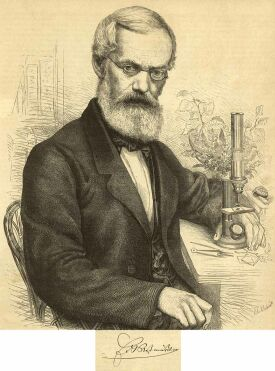

Emil Adolph Roßmäßler
=====================

Emil Adolph Roßmäßler, 1806-1867

.. rst-class:: source

  (Die Gartenlaube. Leipzig 1867, S. 629.)

Naturforscher und Schriftsteller. Er war zwischen 1848 und 1850 Abgeordneter der linken Fraktion des Frankfurter Parlaments. Neben seiner Tätigkeit als Naturwissenschaftler hat Roßmäßler auch Volksliteratur geschrieben. Er war Mitarbeiter der "Unterhaltungen am häuslichen Herd".
