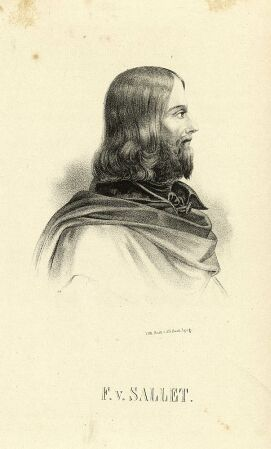

Friedrich von Sallet
====================

Friedrich von Sallet, 1812-1843

.. rst-class:: source

  (Die politischen Lyriker unserer Zeit. Ein Denkmal mit Portraits und kurzen historischen Charakteristiken. Leipzig: Verlagsbureau 1847.)

Preußischer Offizier, Publizist und Dichter, Verfasser eines pantheistischen "Laien-Evangeliums" (1842).
