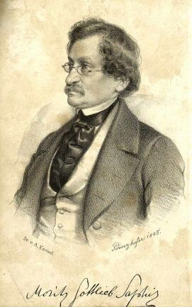

Moritz Gottlieb Saphir
======================

Moritz Gottlieb Saphir, 1795-1858

.. rst-class:: source

  (M. G. Saphir: Fliegendes Album für Ernst, Scherz, Humor und lebensfroher Laune. Bd. 1. Leipzig: Jackowitz 1846.)
