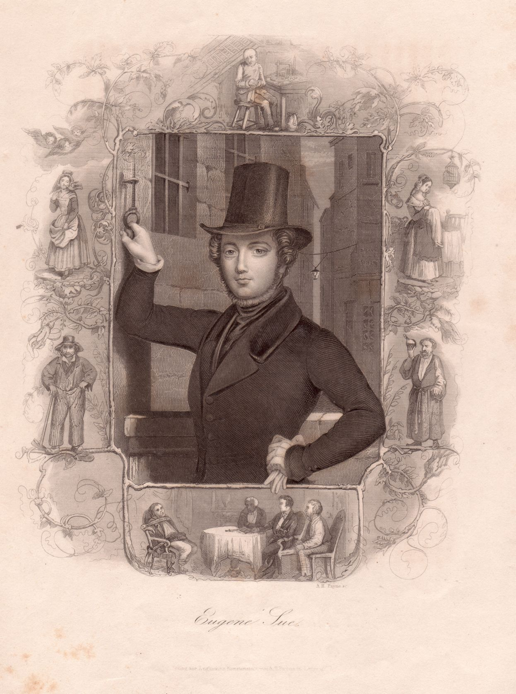

Eugène Sue
==========

Eugène Sue, 1804-1857.

.. rst-class:: source

  (Stahlstich der Englischen Kunstanstalt von Albert Henry Payne in Leipzig um 1845. Einzelblatt, Privatbesitz)

Eugène Sue, umgeben von Figuren und Szenen aus seinem Roman „Die Geheimnisse von Paris“.
