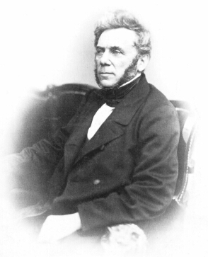

Johann Jakob Weber
==================

Johann Jakob Weber, 1803-1880. Fotografie, um 1860. (Deutsches Buch- und Schriftmuseum der Deutschen Bücherei Leipzig).

.. rst-class:: source

  (In: Wolfgang Weber: Johann Jakob Weber. Der Begründer der illustrierten Presse in Deutschland. Leipzig: Lehmstedt, 2003. S. 55.)

Vgl. auch den entsprechenden Artikel
