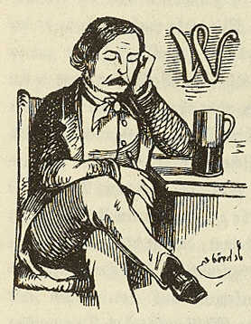

Ludwig Wienbarg
===============

Ludolf Wienbarg, 1802-1872, als "Windpark".

.. rst-class:: source

  (X. Y. Z. Satirisch-literarisches Taschenbuch für 1848. Unter Mitwirkung des jüngsten Deutschlands hg. von einem Unberühmten [d.i. Otto Bernhard Friedmann]. Leipzig: Spamer, 1848. S. 14 .)
