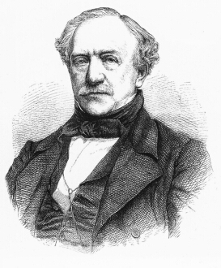

Otto Wigand
===========

Otto Wigand. (Illustrirte Zeitung, 16. Februar 1867). Holzstich.

.. rst-class:: source

  (In: Wolfgang Weber: Johann Jakob Weber. Der Begründer der illustrierten Presse in Deutschland. Leipzig: Lehmstedt, 2003. S. 51.)

Vgl. auch den entsprechenden Artikel
